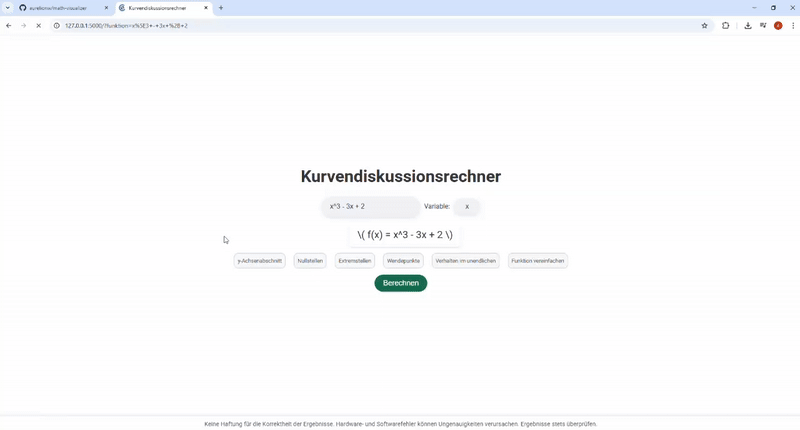
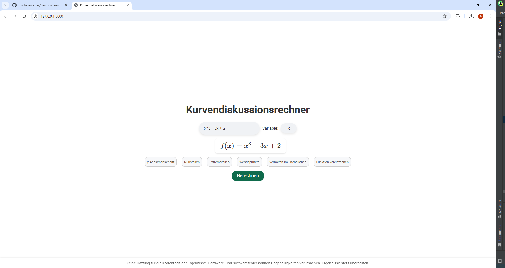
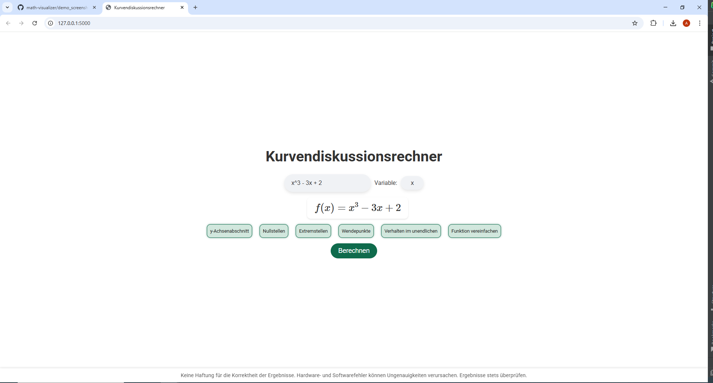
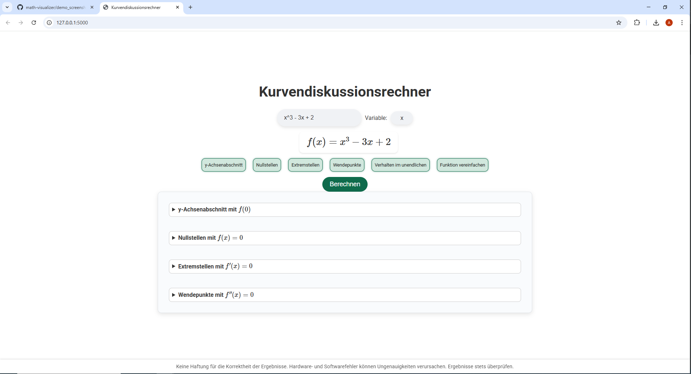
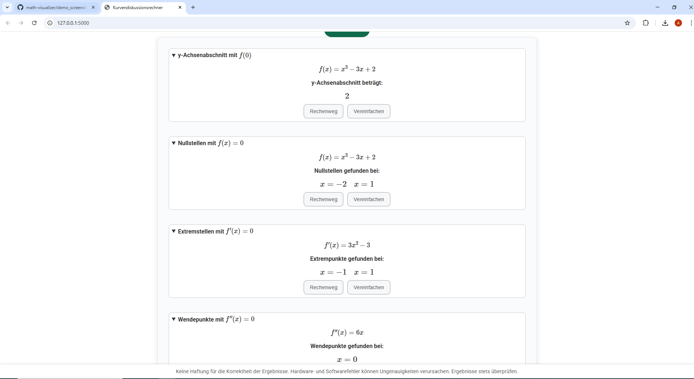

# Math Visualizer – Web-Based Function Analysis Tool

This repository contains a web application for interactive function analysis, including zero-crossings, extrema, inflection points, and end behavior. The tool is primarily aimed at educational and mathematical purposes.

This tool allows users to analyze mathematical functions in an educational, visual and interactive way

## Features

- Detects and plots:
  - Zeros (roots)
  - First and second derivatives
  - Extrema (minima/maxima)
  - Inflection points
  - Asymptotic/end behavior
  - Symmetry properties
- Automatic curve sketching using `matplotlib`
- Step-by-step explanations in LaTeX (e.g., PQ formula, polynomial division)
- Interactive web interface using Flask, JavaScript, and MathJax

## Demo




Below are a few screenshots to demonstrate the interface and functionality:

## 📸 Screenshots

<details>
  <summary>Click to expand screenshots</summary>

  ### Start Page
  

  ### Checkboxes Selected
  

  ### After Clicking "Berechnen"
  

  ### Results Display
  
</details>


## Tech Stack

- **Backend:** Python, Flask, SymPy, NumPy
- **Frontend:** HTML, CSS, JavaScript, MathJax
- **Visualization:** `matplotlib`, LaTeX (for rendering equations)
- **Web Server:** Flask App

## How to Run Locally

```bash
git clone https://github.com/aurelionw/math-visualizer.git
cd math-visualizer
pip install -r requirements.txt
python app.py

Then open your browser and go to:
http://127.0.0.1:5000/

## Author

Aurélio Nwamusse  
[GitHub Profile](https://github.com/aurelionw)

## Disclaimer

This tool is intended for educational use only. Please verify results in academic or professional contexts.


## Project Status

The current version is fully functional and demonstrates all core features, including symbolic analysis and derivtives.
Additional enhancements and UI improvements are planned and will be finalized by **October 2025**.
